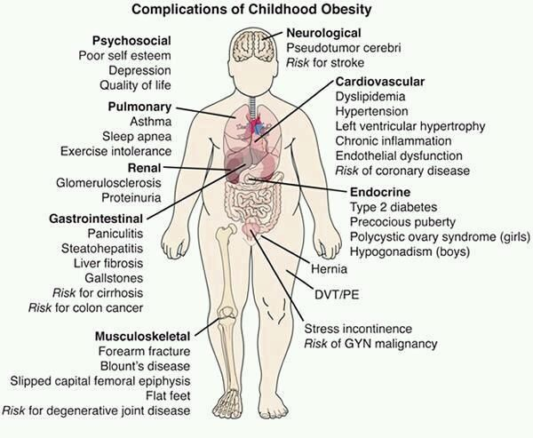

# Obesity Risk Monitoring

By Rong Yang, Anil Inamdar, Mohan Sadashiva and Jaime Heiss. 

This project combines image recognition of people, face recognition, pose estimation and BMI prediction to quantify risk of obesity from images at the edge and accumulates historical data in the cloud to be queried from a dashboard. 

## Rationale

From Mayo Clinic: *"Obesity is a complex disease involving an excessive amount of body fat. Obesity isn't just a cosmetic concern. It is a medical problem that increases your risk of other diseases and health problems, such as heart disease, diabetes, high blood pressure and certain cancers. "*

### Obesity is trending upwards

## Aim: Quantitative metric of obesity risk for a given population by periodic assessment of image-based BMI combined with measurements of anatomical features. 

Our goal is to provide accurate information to stake holders (school principals, school board, pediatricians and nutricionists) about whether the risk of obesity is increasing or decreasing in a given population by daily monitoring, in an anonimous and private way, the changes in key obesity risk metrics in order to allow decision makers to take action and evaluate past actions toward breaking the cycle of obesity.

## Approach:
Obesity risk monitoring is a system for long term monitoring of obesity risk metrics. It runs four machine learning models at the edge to identify people, estimate Body Mass Index (MBI) from face images and detect anatomical points and hip to waist and waist to height ratios, which are relevant metrics to predict obesity risk. The system uses NVDIA Jeston Xavier NX and a high resolution camera at the edge and AWS cloud services. A face recognition model is used for establishing an anonymous ID to each subject which is used to perform queries in the cloud from an AWS S3 bucket using AWS QuickSight. A GUI allows acquisition of images and automatic segmentation to body and face but no user input is required.

The system can easily scale up as each edge device performs all the analysis independently and the amount of data stored in the cloud is small. At the end of a day, all measurements from each subject are aggregated as a robust mean, generating a single line in a CSV file every day, thus the amount of data stored in the cloud is relatively small. 

## Repo contents:

 - BMI_model: All files related to the development of the different ML models for BMI prediction. 

 - image_capture: Code and instalation instructions for deployment of Obesity Risk Monitoring system. 

 - resources: Miscelaneous files.
# Health_Monitoring
